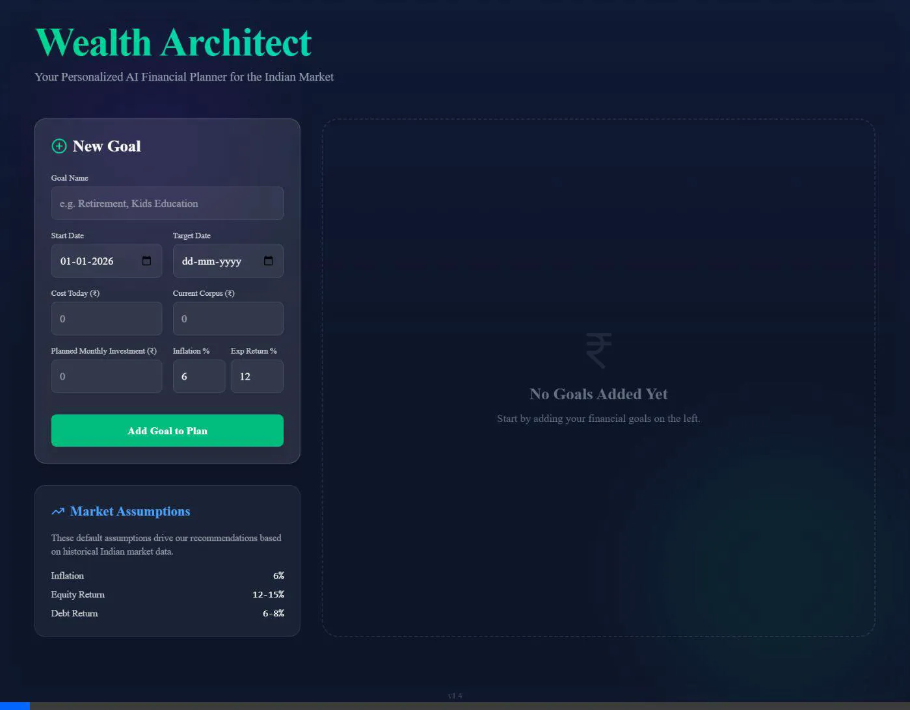

# Financial Recommendation Engine Walkthrough

I have successfully upgraded the application to include a smart logic-based recommendation engine.

## New Features
- **Smart Feasibility Checks**: The system now mathematically verifies if a goal is achievable. If not, it warns you explicitly ("NOT ACHIEVABLE").
- **Asset Class Mapping**: Automatically suggests the safest asset class (Liquid vs Equity) based on your time horizon.
- **Real-Time Data**: Fetches historical returns from `MFAPI.in` for categories like "Large Cap" or "Liquid Funds". If the API fails or is offline, it falls back to your specified hardcoded safety ranges.
- **Confidence Scoring**: Shows a confidence score (0-100) based on how realistic the plan is given the time horizon and risk.

## How to Verify (Golden Test Cases)

Please test the app with these scenarios to confirm the logic:

1.  **Short Term Capital Protection**
    -   **Goal**: "Bike Down Payment"
    -   **Time**: 6 months from now
    -   **Expected Result**:
        -   Status: Achievable (if budget allows)
        -   Recommendation: **Liquid / Arbitrage Funds** or **Short-term Debt**
        -   Risk: **LOW**

2.  **Long Term Wealth**
    -   **Goal**: "Retirement"
    -   **Time**: 15 years from now
    -   **Expected Result**:
        -   Recommendation: **Mid / Small Cap Equity** or **Flexi Cap**
        -   Risk: **VERY HIGH** (Appropriate for 15y)

3.  **Unachievable Goal**
    -   **Goal**: "Dream Villa"
    -   **Target**: ₹ 5 Cr
    -   **Time**: 1 year
    -   **SIP**: ₹ 5,000
    -   **Expected Result**:
        -   Status: **NOT ACHIEVABLE** (Red Badge)
        -   Warnings: "Target corpus not achievable with current inputs."

## Local Hosting Verification
The application has been successfully started locally.
URL: `http://localhost:5173/`

## Alternative Scenarios Verification
Verified the "Alternative Strategies" section with a test goal (Target: ₹ 1L, Date: Dec 2030).
Three risk profiles were correctly recommended:

1.  **Conservative (6.0%)**: Liquid / Arbitrage Funds (Higher SIP)
2.  **Balanced (11.0%)**: Aggressive Hybrid Funds
3.  **Aggressive (13.8%)**: Flexi Cap / Index Funds (Lower SIP)

## Interactive Scenarios Verification
Verified user interactivity for alternative strategies:
1.  **Default View**: Loaded "Test Goal" -> "Conservative" (6%) selected by default. Corpus: ₹ 1.40 L.
2.  **Interaction**: Clicked "Aggressive" card.
3.  **Result**:
    *   **Selection**: "Aggressive" card became highlighted (emerald border).
    *   **Values Updated**: Best Projected Corpus increased to **₹ 1.73 L**.
    *   **Recommendation**: Header updated to "Flexi Cap / Index Funds".

Also confirmed **Budget Tweak Slider** now increments by **₹ 1** (previously ₹ 1000).

## Start Date Verification
Verified that the **Start Date** logic is now robust:
1.  **System Time Fallback**: Uses `d.toLocaleDateString('en-CA')` to correctly get local YYYY-MM-DD (fixing the UTC−1 day bug).
2.  **Network Sync**: Automatically fetches precise time from **WorldTimeAPI (Asia/Kolkata)** on load.
3.  **Reset Behavior**: Resets to the latest available date after adding a goal.

## Version Footer Verification
Verified that **v2.0** is correctly displayed at the bottom of the page in a centered footer.

## v2.0 Specific Fund Recommendations
Verified that the **Recommendation Engine** now suggests specific funds based on the selected strategy.

**Scenario**: User selects "Aggressive" Strategy.
- **Expected**: "Top Rated Funds" section shows Equity funds.
- **Result**: Displayed **Parag Parikh Flexi Cap** and **UTI Nifty 50 Index Fund**.

## v2.0 Wealth Growth Visualization
Verified the new **Wealth Growth Chart** and **Step-Up SIP** functionality.
1.  **Chart Rendering**: Chart correctly displays "Projected Wealth" (red/green gradient) vs "Total Invested" (gray dashed).
2.  **Step-Up Interaction**: Moving the "Annual Step-Up" slider to 10% immediately updated the chart curves and the label.

